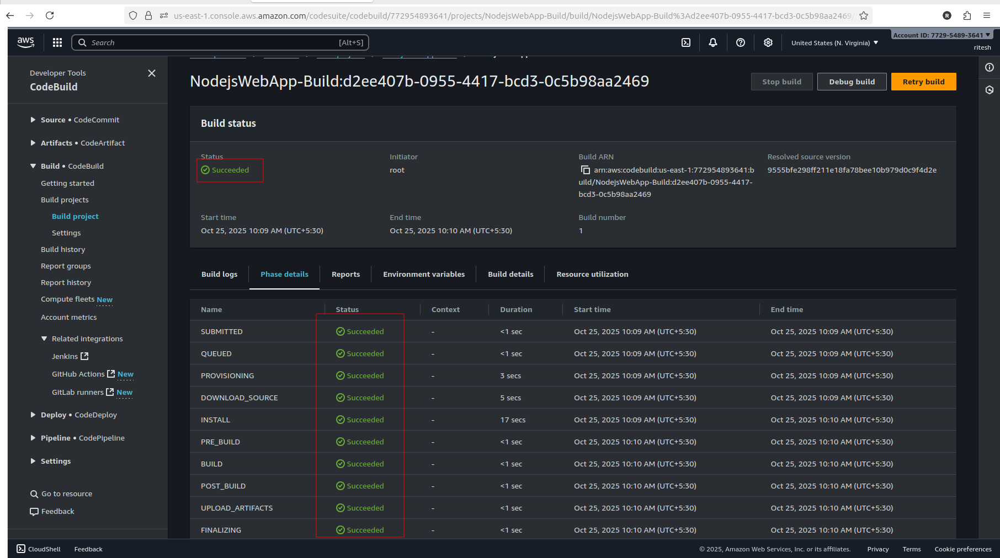

 # AWS CI/CD Node.js Application

  


Welcome to the **AWS CI/CD Node.js Application** repository! This project showcases a production-ready Node.js application deployed on AWS EC2 using a fully automated CI/CD pipeline with AWS CodePipeline, CodeBuild, and CodeDeploy. Integrated with GitHub for seamless source control, this pipeline automates building and deploying the application.

---
## 🚀 Project Overview

This repository hosts a Node.js application (`my-app`) that serves a "Hello from AWS CI/CD!" message on port 3000. Deployed on an AWS EC2 instance (`ip-172-31-19-118`), it leverages a robust CI/CD pipeline to demonstrate modern DevOps practices and cloud infrastructure management.

- **Purpose**: Showcase expertise in building, testing, and deploying a Node.js application using AWS services.
- **Technologies**: Node.js, AWS CodePipeline, CodeBuild, CodeDeploy, EC2, GitHub.
- **Key Achievement**: Resolved deployment issues (e.g., `ScriptFailed` error with `EACCES` permissions) to achieve a stable, automated pipeline.

---
## 🛠️ Features

- **Node.js Application**: Lightweight Express.js server running on port 3000.
- **Automated CI/CD Pipeline**:
  - **Source**: GitHub repository (`ritesh/my-aws-cicd-app`, `main` branch).
  - **Build**: AWS CodeBuild generates `build-artifact.zip`.
  - **Deploy**: AWS CodeDeploy deploys to EC2 (`MyAppDeploy`, `ProductionGroup`).
- **Error Handling**: Fixed permissions issues with `npm install` by optimizing `buildspec.yml` and `install_deps.sh`.
- **Scalability**: Ready for scaling with additional EC2 instances or load balancers.
- **Monitoring**: Application logs (`app.log`) for debugging and verification.

 --- 

## 📁 Repository Structure


## 🛠️ Setup and Deployment

### Prerequisites
- **AWS Account**: Permissions for CodePipeline, CodeBuild, CodeDeploy, EC2, and S3.
- **GitHub Account**: Repository `ritesh/my-aws-cicd-app` with push access.
- **Node.js**: Version 20.19.5 (with npm 10.8.2).
- **EC2 Instance**: Ubuntu with CodeDeploy agent installed.
---
### Local Setup
1. **Clone the Repository**:
   ```bash
   git clone https://github.com/ritesh/my-aws-cicd-app.git
   cd my-aws-cicd-app
   ```
2. **Install dependencies**:
   ```
   npm install
   ```
3. **Run Locally:**:
   ```
   node index.js
   ```
- Access at http://localhost:3000.

---

# AWS CI/CD Pipeline Setup
## Step 1: Create the S3 Bucket for Artifacts

```bash
aws s3 mb s3://myapp-cicd-artifacts-123 --region us-east-1
```
[how to create s3 bucket CLICK](https://github.com/ritesh355/aws-projects/tree/main/02-s3-bucket)
This bucket stores build-artifact.zip generated by CodeBuild.

## Step 2: Launch EC2 Instance & Install CodeDeploy Agent

1. **Launch EC2** (Ubuntu 22.04, t3.micro, `us-east-1`)
2. **Security Group**: Allow inbound:
   - SSH (22)
   - HTTP (3000)

[CLICK-HERE](https://github.com/ritesh355/aws-projects/tree/main/01-ec2-instance)
3. **Install CodeDeploy Agent**:

```bash
sudo apt update && sudo apt install ruby wget -y
wget https://aws-codedeploy-us-east-1.s3.amazonaws.com/latest/install
chmod +x install
sudo ./install auto
sudo systemctl status codedeploy-agent
```
**Tip**: Verify agent is running: sudo systemctl status codedeploy-agent

---

## Step 3: Create IAM Roles

IAM roles are **critical** for secure communication between AWS services. Below are the **four roles** created with **trust policies** and **permissions**.

---

### 1. EC2 Instance Role (`EC2CodeDeployRole`)

**Purpose**: Allows EC2 to download artifacts from S3 and communicate with CodeDeploy.

#### Trust Policy
```json
{
  "Version": "2012-10-17",
  "Statement": [
    {
      "Effect": "Allow",
      "Principal": { "Service": "ec2.amazonaws.com" },
      "Action": "sts:AssumeRole"
    }
  ]
}
```
**Attached Policies**
- AmazonS3ReadOnlyAccess → To download build-artifact.zip
- AWSCodeDeployRole → For CodeDeploy operations
  
Attach this role to your EC2 instance via AWS Console → EC2 → Actions → Security → Modify IAM role.


---
### 2. CodeBuild Service Role (CodeBuildServiceRole)
**Purpose**: Allows CodeBuild to read source, write artifacts to S3, and log.
#### Trust Policy
```json
{
  "Version": "2012-10-17",
  "Statement": [
    {
      "Effect": "Allow",
      "Principal": { "Service": "codebuild.amazonaws.com" },
      "Action": "sts:AssumeRole"
    }
  ]
}
```
**Attached Policies**

- AWSCodeBuildAdminAccess
- AmazonS3FullAccess → Required to upload build-artifact.zip to s3://myapp-cicd-artifacts-123


 
---

### 3. CodeDeploy Service Role (CodeDeployServiceRole)
**Purpose**: Allows CodeDeploy to manage deployments on EC2.
#### Trust Policy
```json
{
  "Version": "2012-10-17",
  "Statement": [
    {
      "Effect": "Allow",
      "Principal": { "Service": "codedeploy.amazonaws.com" },
      "Action": "sts:AssumeRole"
    }
  ]
}
```
***Attached Policy***

AWSCodeDeployRole → Predefined AWS managed policy


---
### 4. CodePipeline Service Role (CodePipelineServiceRole)
**Purpose**: Orchestrates Source, Build, and Deploy stages.
#### Trust Policy
```json

{
  "Version": "2012-10-17",
  "Statement": [
    {
      "Effect": "Allow",
      "Principal": { "Service": "codepipeline.amazonaws.com" },
      "Action": "sts:AssumeRole"
    }
  ]
}
```
**Attached Policies**

- AWSCodePipelineFullAccess
- AWSCodeBuildAdminAccess
- AWSCodeDeployFullAccess
- AmazonS3FullAccess


---
### Step 4: GitHub Repository Setup
```bash
git init
git remote add origin https://github.com/ritesh/my-aws-cicd-app.git
```

.gitignore:
```text
node_modules/
package-lock.json
```
Why? Prevents EACCES errors by excluding locked files from artifacts.

---

### Step 5: buildspec.yml — Build Configuration


```yml
version: 0.2
phases:
  install:
    runtime-versions:
      nodejs: 18
    commands:
      - npm install
  build:
    commands:
      - echo "Build completed"
      - rm -rf node_modules package-lock.json
artifacts:
  files:
    - appspec.yml
    - index.js
    - package.json
    - scripts/**/*
  discard-paths: no
```

**Critical Fix**: rm -rf node_modules package-lock.json avoids permission conflicts.

---
### Step 6: appspec.yml — Deployment Steps


```yml
version: 0.1
os: linux
files:
  - source: /
    destination: /home/ubuntu/my-app
hooks:
  AfterInstall:
    - location: scripts/install_deps.sh
      timeout: 300
      runas: ubuntu
```

Runs install_deps.sh as ubuntu user to avoid root permission issues.

---
### Step 7: scripts/install_deps.sh — Fix Permissions
```bash
#!/bin/bash
cd /home/ubuntu/my-app
rm -rf node_modules package-lock.json
npm install --cache /home/ubuntu/.npm --no-audit
chmod -R u+w node_modules package-lock.json 2>/dev/null || true
```
---
**Key Fixes:**

- Clears old node_modules
- Uses custom npm cache
- Fixes write permissions

---
### Step 8: AWS CodeBuild Project (MyAppBuild)


| Field          | Value                                    |
|----------------|------------------------------------------|
| **Source**     | GitHub (`ritesh/my-aws-cicd-app`)        |
| **Environment**| Ubuntu, Node.js 18                       |
| **Buildspec**  | `buildspec.yml`                          |
| **Artifact**   | S3 → `myapp-cicd-artifacts-123`          |
| **Service Role**| `CodeBuildServiceRole`                  |

---
### Step 9: AWS CodeDeploy Application (MyAppDeploy)


- **Application Name**: MyAppDeploy
- **Compute Platform**: EC2/On-Premises
- **Deployment Group**: ProductionGroup
   - Tag: Name=MyAppServer
   - Instance: ip-172-31-19-118
- **Service Role**: CodeDeployServiceRole

---

### step 10 AWS CodePipeline (`MyAppPipeline`)


| Stage   | Provider       | Configuration                          |
|---------|----------------|----------------------------------------|
| **Source**  | GitHub (v2)    | `MyAppGitHubConnection`, `main` branch |
| **Build**   | CodeBuild      | `MyAppBuild`                           |
| **Deploy**  | CodeDeploy     | `MyAppDeploy`, `ProductionGroup`       |

---

**Live App**: http://<your-ec2-ip>:3000

# 🐞 Troubleshooting

## Common Issue:
ScriptFailed error (exit code 243) due to EACCES permissions.

## Solution:
Ensured `buildspec.yml` excludes `node_modules/` and `package-lock.json`; `install_deps.sh` clears residuals and sets permissions.

## Logs:
```bash
bash sudo tail -n 100 /var/log/aws/codedeploy-agent/codedeploy-agent.log
cat /home/ubuntu/.npm/_logs/*.log
```
---
# Why This Project Stands Out

- **DevOps Expertise:** End-to-end CI/CD pipeline with AWS services.  
- **Problem-Solving:** Resolved complex permissions issues (EACCES on `node_modules/.package-lock.json`).  
- **Automation:** Fully automated deployments with GitHub webhooks.  
- **Clean Code:** Well-structured repository with clear configurations.  

# 📬 Contact

## 👨‍💻 Author

**Ritesh Singh**

🌐 [LinkedIn](https://www.linkedin.com/in/ritesh-singh-092b84340/) 
|
📝 [Hashnode](https://ritesh-devops.hashnode.dev/) 
|
💻[GitHub](https://github.com/ritesh355/)

Feel free to explore, fork, or contribute to this project! 🚀


    
